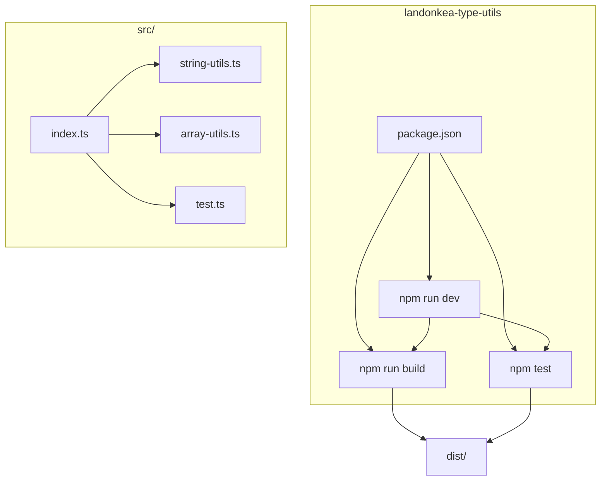
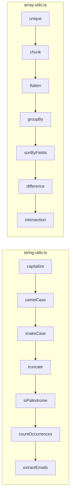
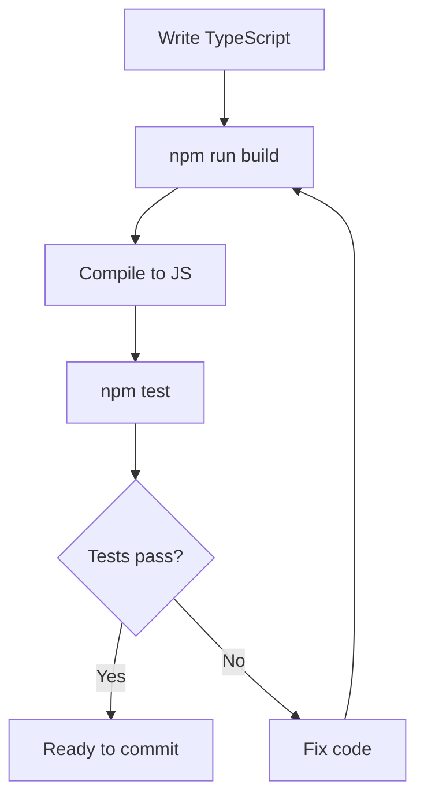

# landonkea-type-utils — Design & Workflow

## High-Level Overview

## Module Structure

## Development Workflow

## File Relationships

| File | Purpose | Used By |
|------|---------|---------|
| `package.json` | Project config | npm |
| `tsconfig.json` | TypeScript config | tsc |
| `src/index.ts` | Entry point | Importers |
| `src/string-utils.ts` | String helpers | `index.ts` |
| `src/array-utils.ts` | Array helpers | `index.ts` |
| `src/test.ts` | Tests | `npm test` |
| `dist/` | Compiled output | Consumers |

## draw.io

[Open in draw.io](https://app.diagrams.net/#RTypeScript%20utility%20library)
